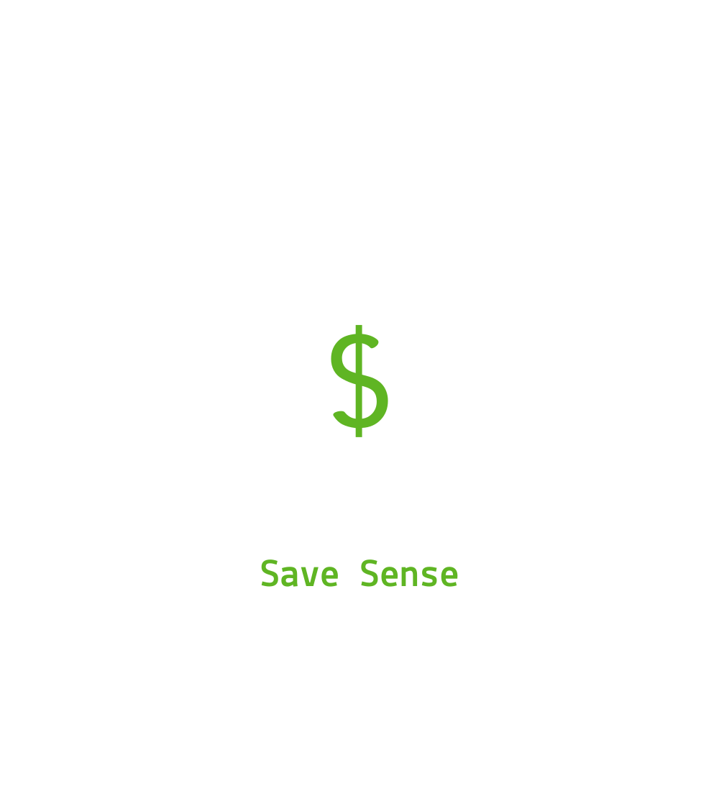

<a name="readme-top"></a>

<div align="center">
  
  <h1><b> 💰 Save Sense 💸 </b></h1>
</div>

<!-- TABLE OF CONTENTS -->

# 📗 Table of Contents

- [📗 Table of Contents](#-table-of-contents)
- [💸 Save Sense ](#-save-sense-)
- [🛠 Built With ](#-built-with-)
  - [📌 Tech Stack ](#-tech-stack-)
- [🎲 Key Features ](#-key-features-)
- [🚀 Live Demo](#-live-demo-)
- [💻 Getting Started ](#-getting-started-)
  - [Prerequisites](#prerequisites)
  - [Setup](#setup)
  - [Usage](#usage)
  - [Run tests](#run-tests)
- [👥 Authors ](#-authors-)
- [🔭 Future Features ](#-future-features-)
- [🤝 Contributing ](#-contributing-)
- [⭐️ Show your support ](#️-show-your-support-)
- [🙏 Acknowledgments ](#-acknowledgments-)
- [📝 License ](#-license-)

<!-- PROJECT DESCRIPTION -->

# 💸 Save Sense <a name="about-project"></a>

**Save Sense** is a mobile web application where you can manage your budget: you have a list of transactions associated with a category, so that you can see how much money you spent and on what.


# 🛠 Built With <a name="built-with"></a>

## 📌 Tech Stack <a name="tech-stack"></a>

| Domain | Tech Stack |
|--------|--------|
| Server | <a href="https://rubyonrails.org/">Ruby on Rails</a> |
| Database | <a href="https://www.postgresql.org/">PostgreSQL</a> |
| Testing Framework | <a href="https://github.com/rspec/rspec-rails">RSpec Rails,</a> <a href="https://rubydoc.info/github/teamcapybara/capybara">Capybara</a> |
| Authentification | <a href="https://github.com/heartcombo/devise#getting-started">Devise</a> |
| Authorization | <a href="https://github.com/CanCanCommunity/cancancan#installation">cancancan</a> | 

<p align="right">(<a href="#readme-top">back to top</a>)</p>
<!-- Features -->

# 🎲 Key Features <a name="key-features"></a>

- Create a new account
- Log in to an existing account
- Sign out from a session
- Create a category
- Add transaction to a category
- Check the list of transactions for a particular category
- Display the total amount of transactions for a particular category
- Tests for category
- Tests for transaction
- Toggle menu
- Dynamic navbar

<p align="right">(<a href="#readme-top">back to top</a>)</p>

# 🚀 Live Demo <a name="live-demo"></a>

👉 [Live Demo](https://save-sense.onrender.com/)<br>
👉 [Video Walkthrough](https://www.loom.com/share/54e91fd72bb74006ad8239c175df6978?sid=824903f4-44e8-494d-8723-933a10078a98)

<p align="right">(<a href="#readme-top">back to top</a>)</p>
<!-- GETTING STARTED -->

# 💻 Getting Started <a name="getting-started"></a>


To get a local copy up and running, follow these steps.

## Prerequisites

In order to run this project you need:

- **Ruby 3.2.2** installed

- **Rails** installed

Run this command to install **Rails**

```sh
 gem install rails
```
## Setup

Clone this repository to your desired folder:

Example commands:

```sh
  cd my-folder
  git clone git@github.com:rica213/Save-sense.git
```

To install dependencies, run:

```sh
bundle install
```

**Set up the database** <br>

To create the database, run:

```sh
rails db:create
```
To create the schema, run:

```sh
rails db:migrate
```

## Usage

To run the project, execute the following command:

Example command:

```sh
  rails server
```

## Run tests

To run tests, run the following command:

```sh
  rspec
```

<p align="right">(<a href="#readme-top">back to top</a>)</p>

<!-- AUTHORS -->

# 👥 Authors <a name="authors"></a>

🤑 **Clarielle Larissa**

- GitHub: [@rica213](https://github.com/rica213)
- Twitter: [@alc3and](https://twitter.com/alc3and)
- LinkedIn: [Clarielle Larissa](https://linkedin.com/in/larissa-clarielle)

<p align="right">(<a href="#readme-top">back to top</a>)</p>

<!-- FUTURE FEATURES -->

# 🔭 Future Features <a name="future-features"></a>

  - Delete a category
  - Edit a category
  - Delete a transaction
  - Edit a transaction
  
<p align="right">(<a href="#readme-top">back to top</a>)</p>

<!-- CONTRIBUTING -->

# 🤝 Contributing <a name="contributing"></a>

Contributions, issues, and feature requests are welcome!

Feel free to check the [issues page](../../issues/).

<p align="right">(<a href="#readme-top">back to top</a>)</p>

<!-- SUPPORT -->

# ⭐️ Show your support <a name="support"></a>

Your support is crucial to the success of this project! There are ways you can contribute and show your support:

- Provide Feedback: If you've tried out the project or have any suggestions for improvement, I would love to hear from you. Your feedback is invaluable in shaping the future direction of the project.

- Kindly Give a 🌟 STAR 🌟 if you like this project!

Remember, your support matters! Whether it's spreading the word, providing feedback, reporting issues, contributing code, or making a donation, every action makes a difference. Together, we can make this project even better.

Thank you for your support and for being a part of this journey! ❤️

<p align="right">(<a href="#readme-top">back to top</a>)</p>

<!-- ACKNOWLEDGEMENTS -->

# 🙏 Acknowledgments <a name="acknowledgements"></a>

I would like to thank: 
- Microverse
- [Gregoire Vella](https://www.behance.net/gregoirevella) for the original design idea
- Code Reviewers

<p align="right">(<a href="#readme-top">back to top</a>)</p>

<!-- LICENSE -->

# 📝 License <a name="license"></a>

This project is [MIT](./LICENSE) licensed.

<p align="right">(<a href="#readme-top">back to top</a>)</p>
